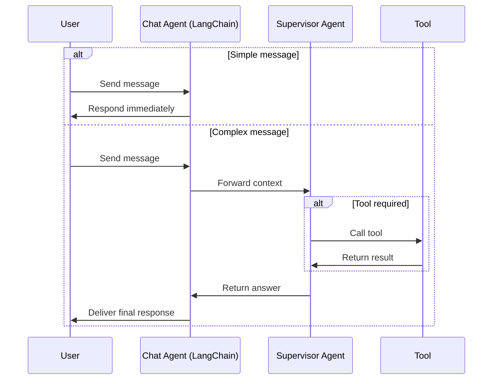

# Agent_SDK_Langchain
Agent_SDK_Langchain
---

## 🎯 Objective

Build a **multi-agent conversational system** using **LangChain**, simulating how ChatGPT agents work:

✅ Quickly respond to simple queries.
🧠 Delegate complex queries to a more intelligent supervisor agent.
🛠️ Call external tools (e.g., search, calculator) when needed.

---

## 🔁 Interaction Flow

---

## 🧩 Components

| Agent             | Role                                               |
| ----------------- | -------------------------------------------------- |
| `ChatAgent`       | Handles simple conversational queries              |
| `SupervisorAgent` | Evaluates query complexity and delegates if needed |
| `Tool`            | Functions/plugins like WebSearch, Calculator, etc. |

---
